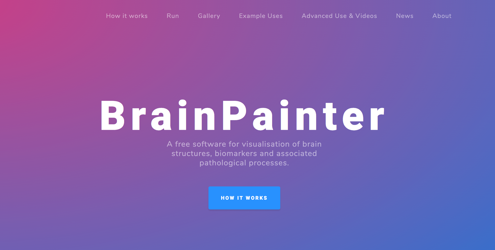

# BrainPainter website - Brain Visualisation and Image Generation from the browser



For any issues, please email me: razvan (at) csail-mit-edu (replace dash with dot). The website template is open-source 
and adapted from the grayscale template: https://startbootstrap.com/themes/grayscale/. It is published under the free, MIT license. 


## Installation

1. Install Flask

2. Install BrainPainter using docker: 

`sudo docker run -it mrazvan22/brain-coloring`. 

Once docker container finishes installation, it should automatically connect to the shell. Once inside docker, pull the latest changes if any:

    ``` cd /home/brain-coloring/ ```
    
    ``` git pull origin master```


2. Run the website using flask:

`
 FLASK_APP=main.py FLASK_ENV=development FLASK_DEBUG=1 flask run
`

## Customisation

Main files to modify are:
* main.py
* templates/index.html

